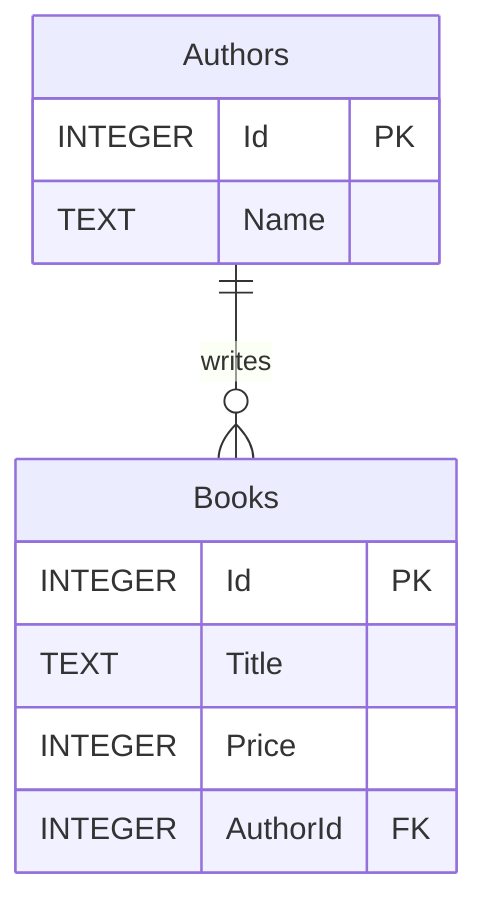
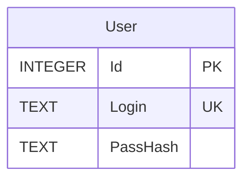

# Схемы данных

## Часть 2 Библиотека книг

`Price` хранится в SQLite целым числом копеек, а в модели C# имеет тип `decimal`.
Удаление автора при наличии его книг запрещено внешним ключом `RESTRICT`.

## Часть 3 Пользователи

В базе пользователей одна прикладная таблица `User`. Логин уникален без учёта
регистра ASCII-букв благодаря индексу и сопоставлению SQLite `NOCASE`.
Для букв за пределами ASCII `NOCASE` не выполняет полноценное приведение регистра.
Служебная таблица SQLite `sqlite_sequence` обслуживает автоинкремент ключей.
